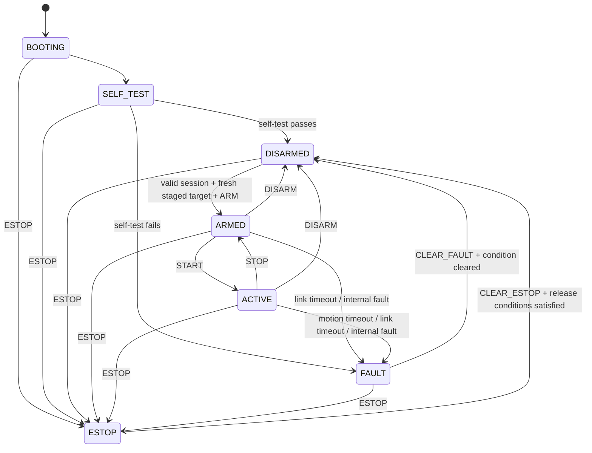

# Servo 2040 Runtime State Machine

**Status:** Accepted for implementation  
**Version:** 1.0  
**Date:** 2026-09-12

## Purpose

This document defines the authoritative runtime state machine enforced by the Servo 2040.

The state machine exists to ensure that servo outputs cannot become active merely because the MCU booted, a USB device connected, or stale motion data exists.

The Servo 2040 always boots safe.

## States

| State | PWM | Meaning |
|---|---:|---|
| `BOOTING` | Off | MCU and runtime initialization |
| `SELF_TEST` | Off | Configuration and hardware validation |
| `DISARMED` | Off | Safe normal resting state |
| `ARMED` | On | Holding a validated target; no continuous motion stream required |
| `ACTIVE` | On | Continuous motion stream required |
| `FAULT` | Off after configured safety response | Latched MCU-detected unsafe condition |
| `ESTOP` | Off | Latched emergency stop |

## State Diagram



## BOOTING

`BOOTING` begins immediately after reset.

Requirements:

- PWM outputs remain disabled.
- No persisted motion target is applied.
- No previously saved servo position may cause automatic motion.
- Runtime structures are initialized.
- The actuator profile is loaded.
- The protocol parser is initialized.
- The status LED may indicate boot progress.

On completion, the MCU enters `SELF_TEST`.

## SELF_TEST

`SELF_TEST` validates the minimum conditions required for safe operation.

At minimum it must validate:

- actuator profile structure;
- expected joint count;
- channel uniqueness;
- legal hard-limit ranges;
- legal direction values;
- legal slew/rate limits;
- internal initialization required for PWM output.

Sensor checks may be added when a sensor is required for actuator safety.

If self-test passes:

```text
SELF_TEST → DISARMED
```

If self-test fails:

```text
SELF_TEST → FAULT
```

PWM remains disabled throughout self-test.

## DISARMED

`DISARMED` is the normal safe state.

Properties:

- PWM outputs are disabled.
- A Pi session may be established.
- Heartbeat is not required merely to remain disarmed.
- A fresh initial joint target may be staged.
- Motion commands are not executed.

A valid `ARM` requires:

1. a valid current protocol session;
2. compatible protocol major version;
3. expected actuator profile identity;
4. no active fault;
5. no active emergency stop;
6. a complete staged logical-joint target;
7. the staged target passing all actuator limits;
8. the staged target being fresh.

The initial staged target must be no older than:

```text
ARM_STAGE_MAX_AGE_MS = 2000
```

The staged target is session-scoped. A new session, fault, emergency stop, or MCU reset invalidates it.

## ARMED

`ARMED` means the hardware is energized and holding a validated target.

Properties:

- PWM is enabled.
- The current logical joint target is held.
- A valid heartbeat is required.
- A continuous `TARGET` stream is **not** required.
- `TARGET` frames are rejected in this state.
- Motion begins only after `START`.

`ARMED` is intentionally distinct from `ACTIVE`.

This allows the robot to be energized and holding a known pose without falsely requiring a moving gait stream.

Valid transitions:

```text
START    → ACTIVE
DISARM   → DISARMED
ESTOP    → ESTOP
fault    → FAULT
```

## ACTIVE

`ACTIVE` means the Pi is continuously driving the actuator target stream.

Properties:

- PWM is enabled.
- Heartbeat is required.
- Fresh valid `TARGET` frames are required.
- Each accepted target is safety-validated before application.
- Invalid targets do not refresh the motion watchdog.
- The Servo 2040 enforces hard actuator limits and hard command-rate limits.

Valid transitions:

```text
STOP     → ARMED
DISARM   → DISARMED
ESTOP    → ESTOP
fault    → FAULT
```

`STOP` holds the last valid applied target and returns to `ARMED`.

`DISARM` disables PWM and returns directly to `DISARMED`.

## FAULT

`FAULT` represents an MCU-detected unsafe condition.

Examples include:

- motion watchdog expiration;
- communications watchdog expiration;
- invalid required hardware state;
- actuator-profile integrity failure;
- internal runtime failure;
- future safety-critical sensor failure.

`FAULT` is latched.

Normal operation does not automatically resume when the triggering condition disappears.

Recovery requires:

```text
CLEAR_FAULT
```

The MCU accepts `CLEAR_FAULT` only when the underlying condition is no longer active.

Successful clearing always returns to:

```text
DISARMED
```

It never returns directly to `ARMED` or `ACTIVE`.

A fresh staged target and explicit `ARM` are required afterward.

### Fault Output Behavior

Watchdog-related faults use a brief hold-before-release behavior:

```text
FAULT_HOLD_MS = 500
```

On a watchdog fault:

1. stop accepting motion;
2. hold the last valid applied target;
3. enter `FAULT`;
4. after the grace interval, disable PWM if the fault remains latched.

This grace interval is intended to reduce an immediate uncontrolled collapse.

Safety-critical hardware faults may bypass the grace interval and disable PWM immediately.

The exact set of immediate-disable faults may expand as hardware capabilities are added.

## ESTOP

`ESTOP` is a latched emergency stop.

Requirements:

- PWM is disabled immediately.
- Active motion is terminated.
- The staged target is invalidated.
- The current protocol session remains diagnostic-only until the E-stop is cleared.
- No command may transition directly from `ESTOP` to an energized state.

Recovery requires:

```text
CLEAR_ESTOP
```

If a physical E-stop input is added later, `CLEAR_ESTOP` is accepted only after that physical input has been released.

Successful clearing always returns to:

```text
DISARMED
```

A new staged target and explicit `ARM` are required.

## Watchdogs

Two independent watchdog concepts are required.

### Link Watchdog

Purpose:

Detect failure of the Pi process or the supervisory communications path.

Initial contract:

```text
HEARTBEAT_RATE_HZ = 10
LINK_TIMEOUT_MS    = 750
```

The link watchdog is enforced while:

- `ARMED`;
- `ACTIVE`.

The link watchdog is not required while `DISARMED`.

Only a valid `HEARTBEAT` for the current session refreshes the link watchdog.

Motion targets do not substitute for heartbeats.

### Motion Watchdog

Purpose:

Detect a locomotion/control loop that has stopped producing fresh targets even though the rest of the Pi process may still be alive.

Initial contract:

```text
TARGET_RATE_HZ    = 50
TARGET_PERIOD_MS  = 20
MOTION_TIMEOUT_MS = 200
```

The motion watchdog is enforced only while `ACTIVE`.

Only a valid, accepted `TARGET` frame refreshes the motion watchdog.

The following do **not** refresh it:

- malformed frames;
- invalid CRC frames;
- stale or duplicate sequence numbers;
- out-of-range targets;
- wrong-session targets;
- targets rejected because of state or profile errors.

Therefore, a Pi process that repeatedly sends invalid targets eventually causes a motion fault instead of keeping the robot indefinitely active.

## Heartbeat and Motion Independence

Heartbeat and motion freshness are deliberately independent.

This detects two different failure classes:

```text
Pi process dead
    → heartbeat stops
    → link watchdog faults

Pi process alive, locomotion loop dead
    → heartbeat continues
    → target stream stops
    → motion watchdog faults
```

Neither mechanism replaces the other.

## Invalid Command Behavior

A semantically invalid command does not automatically cause a fault.

Examples:

- target outside hard limits;
- command invalid in the current state;
- bad argument count;
- wrong session;
- stale target sequence.

The MCU rejects the command and reports the appropriate protocol error.

For an invalid `TARGET`:

- the entire target frame is rejected;
- no individual joint is partially applied;
- the previous valid target remains in effect;
- the motion watchdog is not refreshed.

Repeated invalid motion traffic therefore naturally ends in a motion-timeout fault.

## No Persisted Motion State

Motion state must not survive reboot as an executable target.

The MCU must not automatically restore a previously commanded pose and later energize servos from it.

Persistent storage may contain configuration, calibration, firmware metadata, and actuator profile information.

Persistent storage must not be treated as authorization to move.

Every boot requires:

```text
BOOTING
  ↓
SELF_TEST
  ↓
DISARMED
  ↓
new protocol session
  ↓
fresh staged target
  ↓
explicit ARM
```

## Status LED

The Servo 2040 may use its onboard LEDs to represent state.

The exact colors/patterns are an implementation detail, but the LED must be MCU-owned rather than freely controlled by the Pi during normal runtime.

A future implementation may use patterns such as:

| State | Suggested indication |
|---|---|
| `BOOTING` | Startup animation |
| `SELF_TEST` | Amber |
| `DISARMED` | Dim blue |
| `ARMED` | Green |
| `ACTIVE` | Pulsing green |
| `FAULT` | Red |
| `ESTOP` | Flashing red |

The protocol must not depend on LED behavior.

## Timing Constants

The following values are accepted as version 1 starting values:

| Constant | Value |
|---|---:|
| Target rate | 50 Hz |
| Nominal target period | 20 ms |
| Heartbeat rate | 10 Hz |
| Motion timeout | 200 ms |
| Link timeout | 750 ms |
| Fault hold grace | 500 ms |
| Maximum staged-target age before arm | 2000 ms |

These are safety-related configuration values.

Changing them after implementation requires testing and documentation.

## Change Control

Changes to state semantics require:

1. a protocol revision if wire behavior changes;
2. an ADR when the safety model changes materially;
3. tests covering every affected transition.

Related documentation:

- [Control Boundary](control-boundary.md)
- [Pi–Servo 2040 Protocol v1](../protocols/pi-servo2040-v1.md)
- [ADR-0003: Servo 2040 Runtime Safety](../decisions/0003-servo2040-runtime-safety.md)
